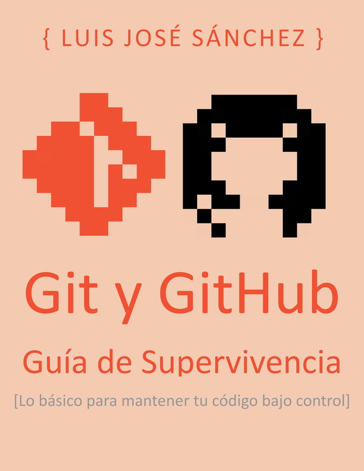

# Ejercicios de Programación

Repositorio con los ejercicios de la asignatura **Programación** de **1º DAW (Desarrollo de Aplicaciones Web)** del IES Campanillas.

## Recordatorio de cómo hacer un *fork*

Mostramos los pasos a seguir para hacer un *fork*.

* Ve al repositorio del cual quieras obtener algún directorio o archivo
* En la esquina superior derecha pulsa el botón que pone *fork*
* Una vez en tu repositorio, ve al botón verde *Clone or download*
y pincha en *Copy to clipboard*
* Lo siguiente es clonar el directorio:

Ve al directorio raíz donde quieras colocarlo y escribe el siguiente comando:

```console
git clone https://github.com/ivanmirandastavenuiter/ejercicios-programacion.git
```

## Cómo pintar una pirámide en java

´´´

public class Ejercicio19 {
  public static void main(String[] args) {
    System.out.println("Este programa pinta una pirámide en la pantalla.");
    System.out.println("Si quieres ver la tuya, introduce la altura que quieres que tenga: ");
    int altura = Integer.parseInt(System.console().readLine());
    
    System.out.println("Perfecto. Ahora pon el carácter que prefieras: ");
    String c = System.console().readLine();
    
    int fila = 0;
    
    do {
    
      for (int espacio = altura - 1; espacio > 0; espacio--) {
      System.out.print(" ");
      }
  
      for (int i = fila; i > 0; i--) {
        System.out.print(c);
      }
        System.out.println(c);
      
        fila += 2;  
        altura--;
        
    } while (altura > 0);
  }
}

´´´

## Qué se aprende en Programación

*  :coffee: Lenguaje Java
*  :penguin: Comandos de Linux
*  :octocat: Git y GitHub

## Bibliografía




[Git y GitHub](https://leanpub.com/gitygithub)

[Aprende Java con ejercicios](https://leanpub.com/aprendejava)

